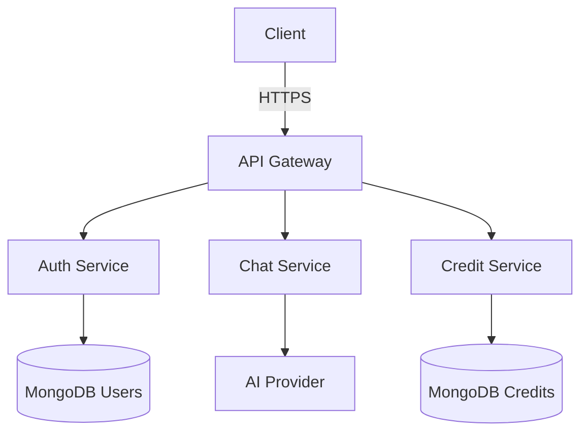
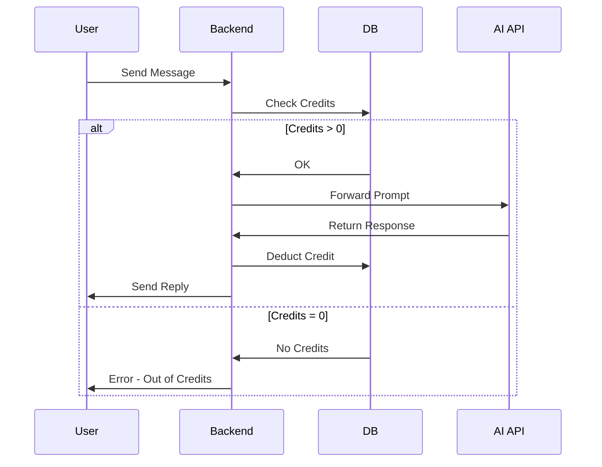

# 🤖 EmoAI ChatBot Next-Gen (MERN + EndGaming AI)  
[](https://choosealicense.com/licenses/mit/)  
[](https://react.dev/)  
[](https://nodejs.org/)  
[](https://www.mongodb.com/)  

---

## 📌 Overview
**EmoAI** is a **Next-Gen AI-powered chatbot** built with the **MERN stack** and integrated with the **EndGaming AI API**.  
It features **emotional intelligence**, **credit-based usage control**, and **personalized adaptive responses** to user moods.  

---


---

## 🎯 Key Features

| Feature | Description |
|---------|-------------|
| 🧠 **AI-Powered Chat** | Real-time intelligent conversations with EndGaming AI |
| 🎭 **Emotion Adaptation** | Responses change based on user mood |
| 🔒 **JWT Authentication** | Secure login & token refresh |
| 💳 **Credit System** | Manage API usage with credits |
| 📊 **User Analytics** | Track usage patterns & credit consumption |
| ⚡ **Real-Time UI** | Smooth chat interface with React & Tailwind |

---

### 🎭 Emotion Response Matrix

| Emotion | Response Style | Example |
|---------|---------------|---------|
| 😠 Angry | Calm + Solution-Oriented | "Let's work through this together..." |
| 😔 Sad | Empathetic + Encouraging | "I'm here to listen..." |
| 😃 Happy | Enthusiastic + Playful | "That's fantastic! 🎉" |

---

## 🛠 Tech Stack

**Frontend**  
- React.js  
- Tailwind CSS  
- Axios  

**Backend**  
- Node.js + Express.js  
- MongoDB + Mongoose  
- JWT & Bcrypt for Security  

---

## 🏗️ System Architecture



---

## 🚀 Getting Started

### 1️⃣ Prerequisites
Make sure you have:
- **Node.js** v18+
- **MongoDB** v6+
- **EndGaming AI API Key**

---

### 2️⃣ Installation

#### Clone Repository
```bash
git clone https://github.com/201Harsh/AI-CB.git
cd AI-CB
```

#### Backend Setup
```bash
cd Backend
npm install
cp .env.example .env
# Add your MongoDB URI & API keys in .env
npm run dev
```

#### Frontend Setup
```bash
cd ../Frontend
npm install
npm run dev
```

---

## ⚡ Usage
1. **Register** for a new account.  
2. **Login** to access the chatbot.  
3. Each user starts with **free credits** (configurable in `.env`).  
4. Ask your questions — each consumes **1 credit**.  
5. When credits run out, you’ll need to **refill**.

---

## 🔌 API Integration Example

```javascript
app.post("/api/chat", async (req, res) => {
  const { prompt, emotion } = req.body;
  const response = await axios.post("https://api.endgaming.ai/v4/chat", {
    prompt,
    emotion,
    apiKey: process.env.ENDG_API_KEY,
  });
  res.json(response.data);
});
```

---

## 💳 Credit System Flow



---

## 🗺 Roadmap
- 💸 Credit Purchase System  
- 📚 Save Chat History  
- 🎤 Voice Input Support  
- 🌐 Multi-language Responses  

---

## 🤝 Contributing

We ❤️ contributions!  

1. **Fork** the repo  
2. **Create** your branch:  
   ```bash
   git checkout -b feature/AmazingFeature
   ```  
3. **Commit** your changes:  
   ```bash
   git commit -m 'Add some AmazingFeature'
   ```  
4. **Push** to branch:  
   ```bash
   git push origin feature/AmazingFeature
   ```  
5. **Open a Pull Request** 🎉

---

## 📜 License
This project is licensed under the **MIT License**.  
See [LICENSE](./LICENSE) for details.

---

## 🌍 Live Demo
🔗 **[View Live App](https://emoaichatbot.onrender.com/)**

---

## 📮 Contact & Support
- **Developer:** Harsh ([GitHub](https://github.com/201Harsh) | [Instagram](https://www.instagram.com/201harshs/))  
- **Support:** support@endgamingai2@gmail.com  

---

**Made with ❤️ by Harsh**
