# 🤖 EmoAI ChatBot (MERN + EndGaming AI) [](https://choosealicense.com/licenses/mit/)

Now upgraded to its next-gen version, this AI-powered chatbot web application is built on the MERN stack (MongoDB, Express.js, React.js, Node.js) and seamlessly integrates the Endgaming AI API. Users can register, log in, and engage with an intelligent, adaptive chatbot—enhanced by a credit-based system to manage API usage effectively.

---


An AI-powered chatbot web application with emotional intelligence, built using the MERN stack. Features user authentication, credit-based API access, and dynamic response adaptation based on user sentiment.

[](https://react.dev/)
[](https://nodejs.org/)
[](https://www.mongodb.com/)

---

## 🎛️ Table of Contents

- [Key Features](#-key-features)
- [Tech Stack](#-tech-stack)
- [System Architecture](#-system-architecture)
- [Installation](#-installation)
- [Configuration](#-configuration)
- [API Integration](#-api-integration)
- [Credit System](#-credit-system)
- [Security](#-security)
- [Screenshots](#-screenshots)
- [Roadmap](#-roadmap)
- [Contributing](#-contributing)
- [License](#-license)
- [Support](#-support)

---

## 🌟 Key Features

| Feature                   | Description                                                 |
| ------------------------- | ----------------------------------------------------------- |
| 🧠 **AI-Powered Chat**    | Integration with EndGaming AI for intelligent conversations |
| 🔒 **JWT Authentication** | Secure user authentication with token refresh               |
| 💳 **Credit System**      | Usage-based credit management (1 credit/request)            |
| 🎭 **Emotion Adaptation** | Dynamic responses based on detected user mood               |
| 📊 **User Analytics**     | Track usage patterns and credit consumption                 |
| ⚡ **Real-Time UI**       | Interactive chat interface with React                       |

### Emotion Response Matrix

| User Emotion | Response Style           | Example Response                      |
| ------------ | ------------------------ | ------------------------------------- |
| 😠 Angry     | Calm + Solution-Oriented | "Let's work through this together..." |
| 😔 Sad       | Empathetic + Encouraging | "I'm here to listen..."               |
| 😃 Happy     | Enthusiastic + Playful   | "That's fantastic! 🎉..."             |

## 🌈 Emotional Response System

Mood Adaptation Matrix
User Emotion AI Response Pattern Sample Response

- 😠 Angry Calm + Solution-Oriented "Let's work through this..."
- 😔 Sad Empathetic + Encouraging "I'm here for you..."
- 😃 Happy Enthusiastic + Playful "That's awesome! 🎉..."

## Visual

```mermaid
graph TB
    A[🧠 AI-Powered Chat] --> A1[`Integration with EndGaming AI`]
    B[🔒 JWT Authentication] --> B1[`Secure login with token refresh`]
    C[💳 Credit System] --> C1[`1 credit per request`]
    D[🎭 Emotion Adaptation] --> D1[`Dynamic mood-based replies`]
    E[📊 User Analytics] --> E1[`Track usage & credits`]
    F[⚡ Real-Time UI] --> F1[`React-based live chat`]

    subgraph Emotion_Response_Matrix
        EM1[😠 Angry] --> ER1[`Calm + Solution-Oriented: Let's work through this...`]
        EM2[😔 Sad] --> ER2[`Empathetic + Encouraging: I'm here to listen...`]
        EM3[😃 Happy] --> ER3[`Enthusiastic + Playful: That's fantastic! 🎉...`]
    end

    D --> Emotion_Response_Matrix

```



---

## 🛠 Tech Stack

**Frontend**


**Backend**


**Security**


---

# 🧠 Core Architecture

## 🏗️ System Architecture


---

# 🚀 Getting Started

## 💫 Installation

**Prerequisites**

- Node.js v18+

- MongoDB v6+

- EndGaming API Key

### 1. Clone the Repository

```bash
git clone https://github.com/201Harsh/AI-CB.git
cd ai-cb
```

### 2. Setup Backend

```bash
cd Backend
npm install
```

### 3. Setup Frontend

```bash
cd Frontend
npm install
npm run dev
```

---

# ✨ Usage

- Register a new user

- Login to your account

- Each user gets initial free credits (configurable)

- Ask a question to the chatbot

- Response is generated via AI API

- Each query consumes credits

---

# ✨ API Usage:

## EndGaming AI API (or you can use other AI API)

### 🔧 Configuration

### 📡 API Integration

```javascript
// Example API call to EndGaming AI
app.post("/api/chat", async (req, res) => {
  const { prompt, emotion } = req.body;

  const response = await axios.post("https://api.endgaming.ai/v4/chat", {
    prompt,
    emotion,
    apiKey: process.env.ENDG_API_KEY,
  });
  res.json(response.data);
});
```

---

# 📦 API Integration

#### Using Google Gemini or a similar Google AI API:

- Backend makes POST requests to the API with the user’s prompt

- Response is returned to the frontend

- Credit is deducted per request

---

# 💳 Credit System

- New users receive 10 free credits
- Credit deduction workflow:


---

# 🧮 Credit System (Example)

- Each user starts with 10 credits

- 1 credit = 1 chatbot question

- Credit deduction logic is handled in the backend

- Prevents queries when credits are 0

---

# 📌 TODOs

- Add UI feedback for no credits

- Add option to purchase or earn more credits

- Improve chatbot UI with typing effect

- Save chat history per user

---

# 🛡️ Security

- Passwords are hashed using bcrypt

- JWT tokens are used for authentication and route protection

- Rate-limiting (optional for production)

---

# 🗺 Roadmap

- 💸 Credit Purchase System

- 📚 Chat History Storage

- 📊 User Analytics Dashboard

- 🎤 Voice Input Support

- 🌐 Multi-language Support

# 📃 License

[](https://choosealicense.com/licenses/mit/)

```text
MIT License

Copyright (c) 2025 Harsh (@201Harsh)

Permission is hereby granted, free of charge, to any person obtaining a copy
of this software and associated documentation files (the “Software”), to deal
in the Software without restriction, including without limitation the rights
to use, copy, modify, merge, publish, distribute, sublicense, and/or sell
copies of the Software, and to permit persons to whom the Software is
furnished to do so, subject to the following conditions:

The above copyright notice and this permission notice shall be included in
all copies or substantial portions of the Software.

THE SOFTWARE IS PROVIDED “AS IS”, WITHOUT WARRANTY OF ANY KIND, EXPRESS OR
IMPLIED, INCLUDING BUT NOT LIMITED TO THE WARRANTIES OF MERCHANTABILITY,
FITNESS FOR A PARTICULAR PURPOSE AND NONINFRINGEMENT. IN NO EVENT SHALL THE
AUTHORS OR COPYRIGHT HOLDERS BE LIABLE FOR ANY CLAIM, DAMAGES, OR OTHER
LIABILITY, WHETHER IN AN ACTION OF CONTRACT, TORT OR OTHERWISE, ARISING FROM,
OUT OF OR IN CONNECTION WITH THE SOFTWARE OR THE USE OR OTHER DEALINGS IN THE
SOFTWARE.
```

---

## 💬 Acknowledgments

- MongoDB (Database)

- Express (Backend)

- React (Frontend)

- Node.js (Server)

- END Gaming AI API (AI Used for Emotional Analysis)

- Google Gemini AI API (AI Used for Intelligence and General Knowledge)

---

# 🤝 Contributing

- Fork the Project

- Create your Feature Branch (git checkout -b feature/AmazingFeature)

- Commit your Changes (git commit -m 'Add some AmazingFeature')

- Push to the Branch (git push origin feature/AmazingFeature)

- Open a Pull Request

---

# Live Preview
 - see the site live at
*https://emoaichatbot.onrender.com/*

---

## 📮 Contact & Support

- Lead Developer: Harsh (@201Harsh)
- GitHub : [201Harsh](https://github.com/201Harsh) | Instagram : [201harshs](https://www.instagram.com/201harshs/)

- Support Portal: support@endgamingai2@gmail.com

---

## Made With ❤️ by Harsh